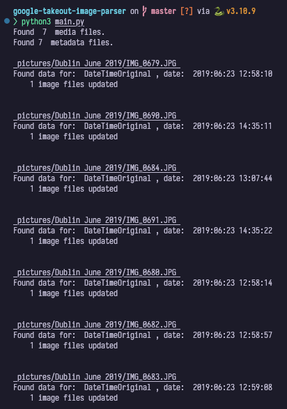

# Google Photos Takeout Image Parser

This script is designed to sort and organize media files from a Google Photos Takeout export, which contains separate JSON files for metadata and media files without metadata. The script aims to make sure the exported media files are in chronological order, so they can be easily uploaded to another service such as iCloud Photos. The script uses various sources to determine the creation date of each media file, including Exif metadata, Google Photos JSON, and manually-created fallback JSON files.

## Prerequisites

- A Google Photos Takeout [export](https://takeout.google.com) of your media files.
- Latest version of python 3 installed on your computer
- `exiftool` installed on your computer (can be installed with Homebrew on macOS, most package managers on Linux, or downloaded on Windows)

## Getting started & Usage

1. Clone the repository
2. Open the script in a text editor and customize it to fit your needs, such as where the pictures and output should be, log verbosity, etc.
3. Unzip the takeout archive and place the folders in the configured input path
4. Run the `main.py` script using python 3. By default, the script will apply changes to the media files. To run a 'dry run', tweak the flag in the script accordingly.

The script will then process all media files in the specified folder and sub-folders, updating their metadata and placing them in the output path.

## Fallback mechanism

If no Exif metadata or Google Photos JSON is found for a media file, the script will attempt to use manually-created fallback JSON files to determine the creation date. These fallback JSON files should be located at the root of each album or folder and be named fallback.json. They should contain the following key-value pair:

```json
{
  "fallbackTime": "2022:01:01 00:00:00"
}
```

# Screenshots



# Disclaimer

This script is provided as is and without any warranty or guarantee. The script has only been tested on the author's specific use case and may not work as expected on other systems or configurations. Always take a backup of your pictures before running the script and inspect the script yourself before running it. The author takes no responsibility for any loss of data or damage to files resulting from the use of this script.
